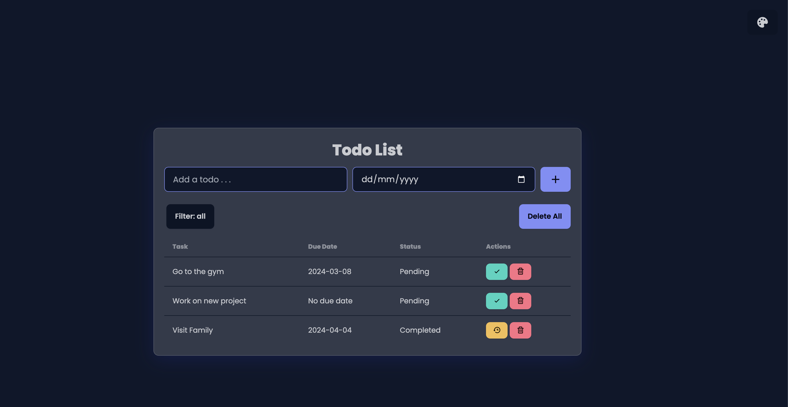

# TODO App

<div align="center">
  
</div>

# Setup

In`fronend` folder run:
```
docker compose up -d --build
```

Next, in `backend` folder, create `.env` by copying content from `.env.example`:
```
cp .env.example .env
```
Then start backend:
```
docker compose up -d --build
```
Then `exec` into backend to migrate DB:
```
docker compose exec app yarn migrate:deploy
```
Finally open browser at `http://localhost:5173`

# Local development
Run `yarn install` (or `npm install`) for both `backend` and `frontend`

Next, in `backend` folder, create `.env` by copying content from `.env.example`, update DB credentials to match your machine

Then start backend:
```
yarn start:dev
```
To migrate DB for backend run:
```
yarn migrate:deploy
```
Next start frontend:
```
yarn dev
```
Finally open browser at `http://localhost:5173`